# 🏫 MATRYERSE – Comprehensive School Management SaaS Platform

[Versión en Español](./README.es.md)

**MATRYERSE** is an innovative web platform based on the **Software as a Service (SaaS)** model, designed to optimize the academic, administrative, and financial management of educational institutions in Bogotá and other cities. Its multi-institutional approach allows multiple schools to use the same system independently, ensuring complete privacy and data isolation for each institution thanks to a logical multi-tenancy architecture.

The platform aims to centralize essential processes such as:

-   Student enrollment by academic period.
-   Assignment of teachers to groups and subjects.
-   Management of grades and attendance tracking.
-   Administration of payments and financial items.
-   Report generation and action traceability.

**MATRYERSE** is ideal for institutions seeking to modernize their daily operations, reduce manual processes, improve data traceability, and offer a solid digital experience to their administrative staff, teachers, students, and parents.


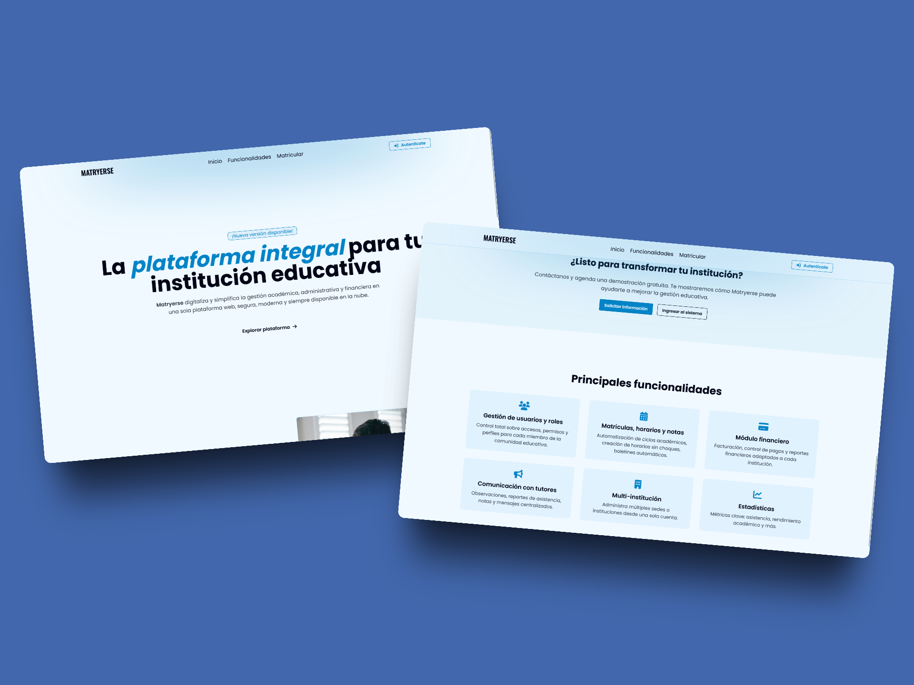

---

## 📑 Tabla de Contenidos

1. [Main Features](#-main-features)
2. [Technologies Used](#️-technologies-used)
3. [Architecture](#️-architecture)
4. [Usage Flow](#-usage-flow)
5. [Folder Structure](#-folder-structure)
6. [Installation](#️-installation)
7. [Contact](#-contact)
8. [License and Use](#️-license-and-use)

---

## 🚀 Main Features

### 📌 Institution Management

Allows administrators to manage multiple educational institutions independently through a multi-tenant architecture, ensuring data privacy among them.

-   Logical multi-tenancy.
-   Create, edit, and delete institutions.
-   Full data isolation between institutions.

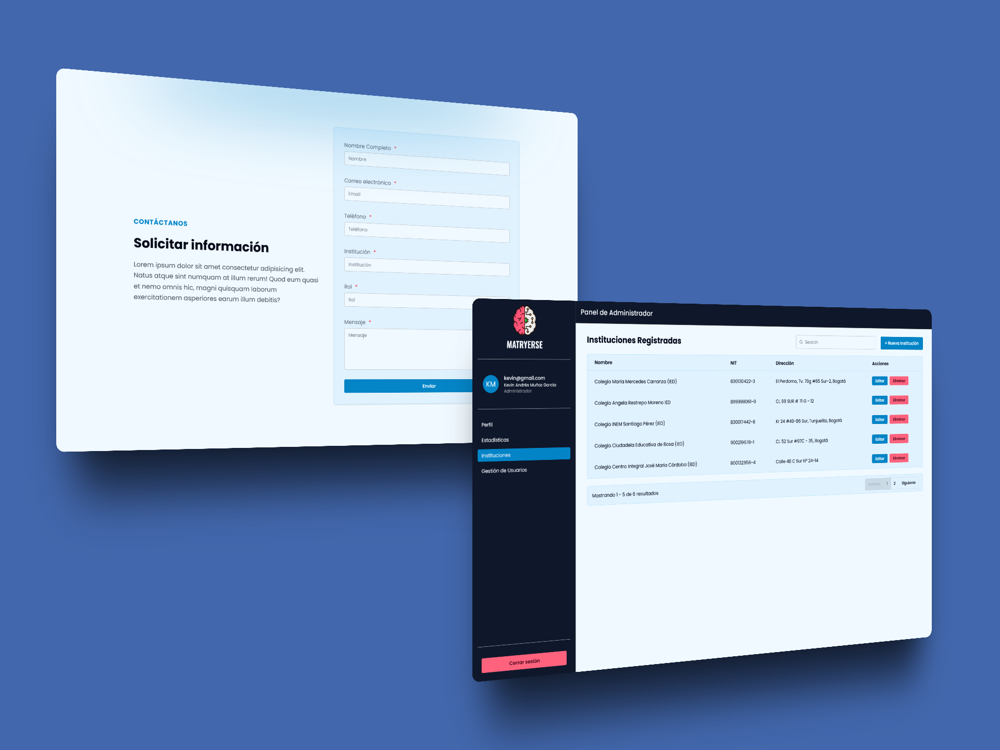

### 🔐 Authentication and Access Control

Robust authentication system enabling secure user access according to their roles (Guest, Admin, Staff, Teacher, Student, Tutor) with custom permissions and views.

-   Secure login validation.
-   Password recovery.
-   Role-based access and permission control.

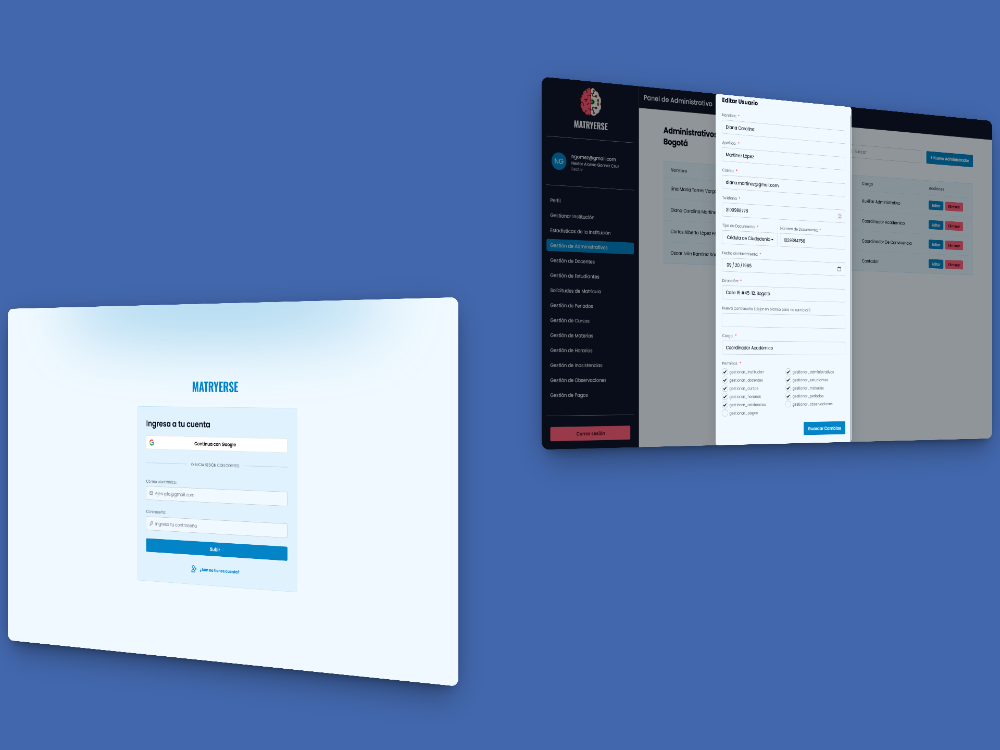

### 👥 User Management

Functionality to create, edit, delete, and assign roles to users on the platform, allowing efficient management of staff, teachers, students, and tutors.

-   User registration and editing.
-   Role and permission assignment.
-   Account active/inactive state management.

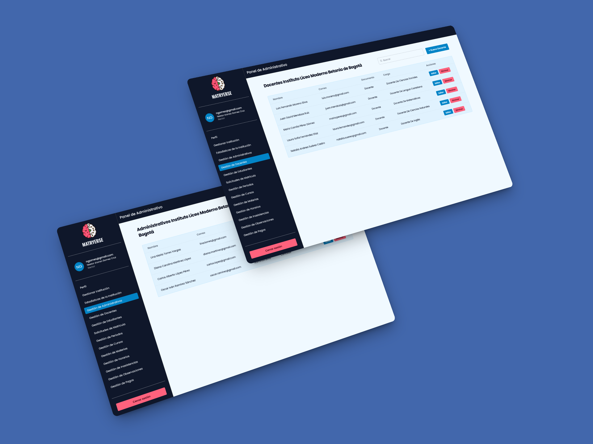

### 📝 Enrollment Management

Allows staff to register and manage student enrollments by academic period. Includes application form and confirmation via email.

-   Application form for candidates.
-   Enrollment validation and approval.
-   Email notification.

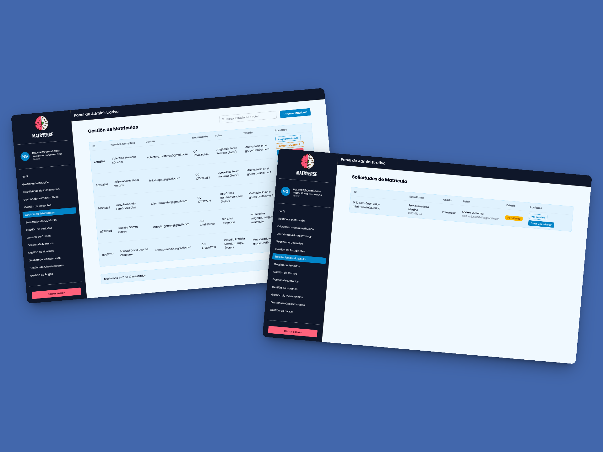

### 📧 Information Request

Visitors (Guests) can fill out a contact or application form. The information is automatically sent to the administrators of the selected institution.

-   Customizable contact form.
-   Automatic data submission to administrators.
-   Request log for follow-up.

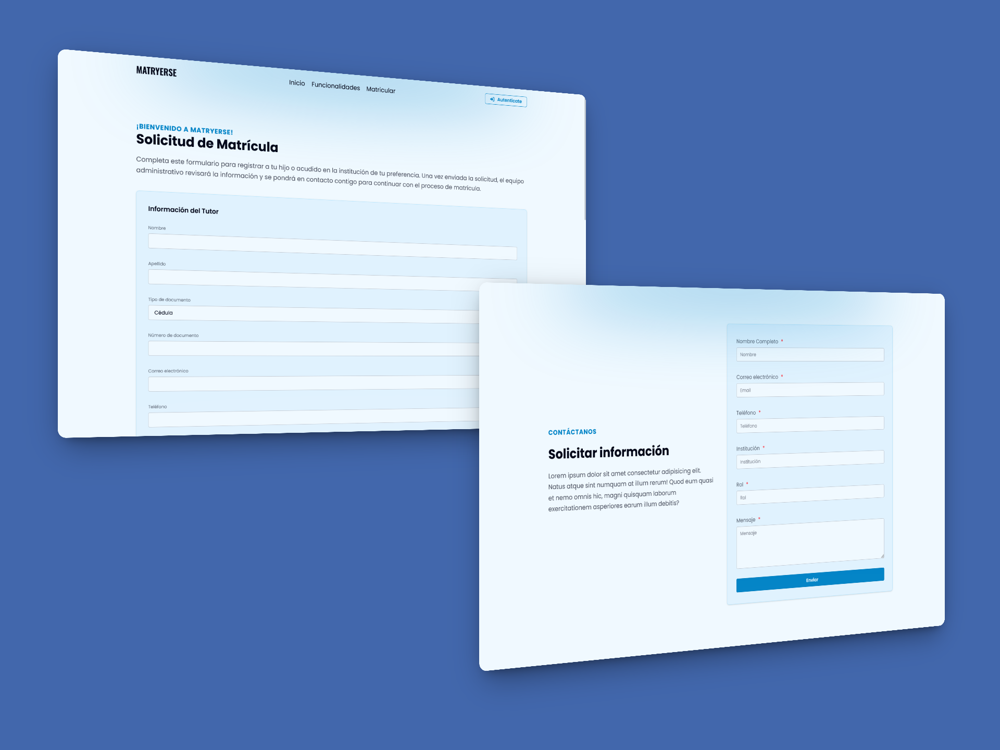

### 📊 General and Institutional Statistics

Displays relevant data such as number of enrolled students, attendance, completed payments, and other indicators for informed decision-making.

-   Dashboard with key indicators.
-   Filters by institution and academic period.
-   Report export.

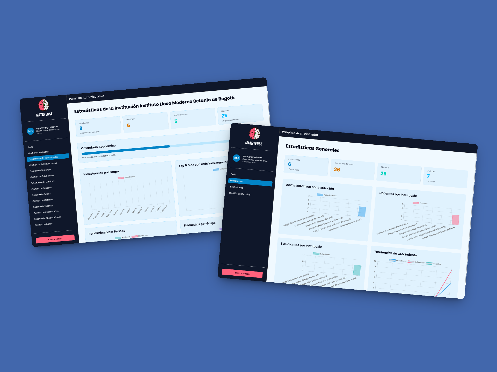

### 🏫 Academic Structure Management

Module to define and manage the institution's academic structure: periods, courses, subjects, teacher assignments, class schedules, and academic loads.

-   Create courses, subjects, and periods.
-   Assign teachers to groups and subjects.
-   Configure class schedules.

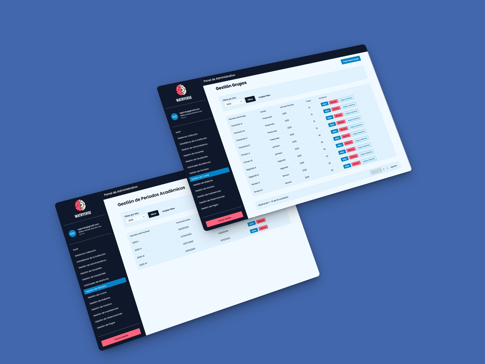

### 💳 Payment Registration and Management

Allows registration of payments for enrollment, tuition, and other financial concepts. Includes payment traceability per student and report generation.

-   Manual or automatic payment registration.
-   Payment history by student.
-   Invoice and receipt generation.

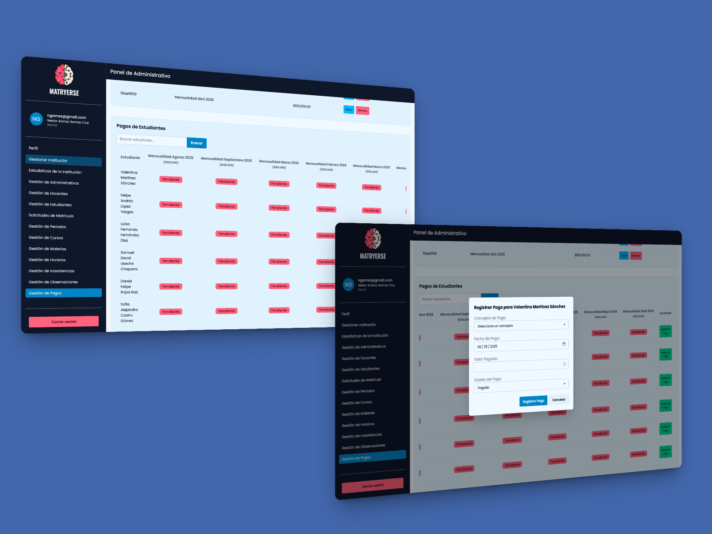

### 🗒️ Observations and Attendance Management

Teachers can record student absences and observations, which are visible to tutors and staff, ensuring comprehensive student monitoring.

-   Daily absence recording.
-   Academic or disciplinary observations.
-   Report view for tutors.

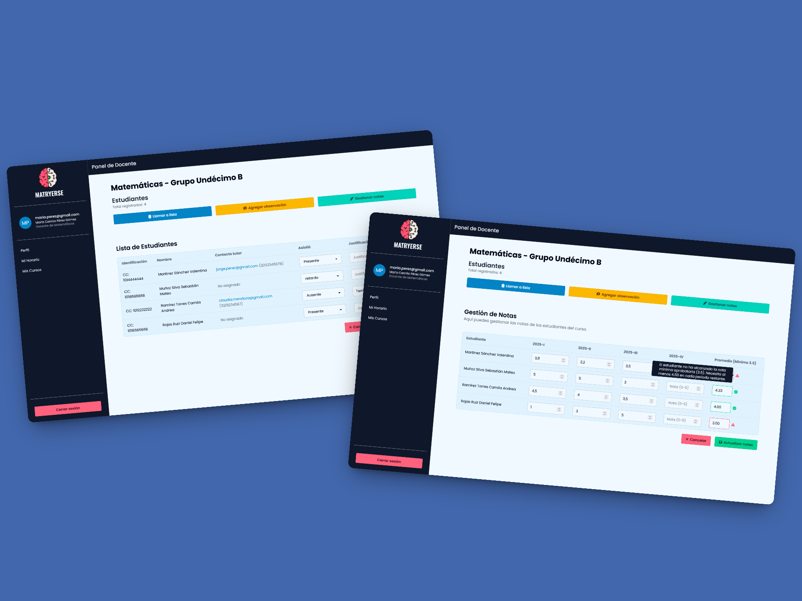

### 🕒 Schedule View

Teachers, students, and tutors can easily view class schedules for different groups, enabling better organization of daily activities.

-   Role-based personalized schedule view.
-   Weekly schedules of courses and subjects.
-   Details on subjects, classrooms, and teachers.

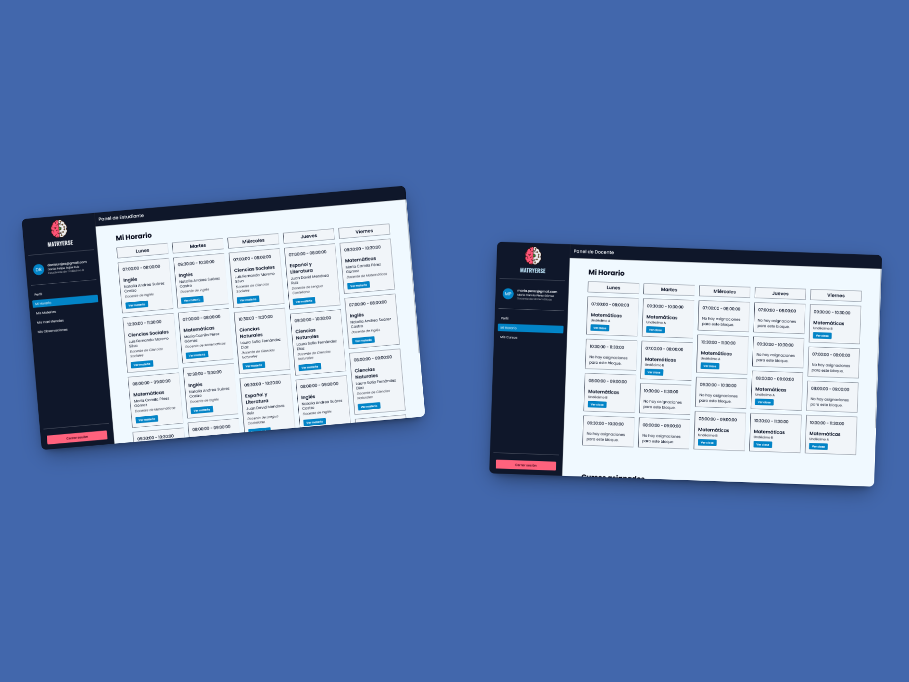

---

## 🛠️ Technologies Used

### **Frontend**

-   **Laravel Blade** - Laravel template engine
-   **Vite** - Bundler and dev server
-   **Tailwind CSS v4** - Utility-first CSS framework
-   **DaisyUI** - Tailwind UI components
-   **Axios** - HTTP client for API requests
-   **SweetAlert2** - Alert and notification library

### **Backend**

-   **Laravel 10** - PHP framework
-   **Laravel API** - RESTful endpoints
-   **Eloquent ORM** - Laravel’s ORM
-   **MySQL** - Relational database
-   **Migrations** - Database version control
-   **Seeders** - Initial data population
-   **Factories** - Dummy data generation

---

## 🏗️ Architecture

### **Client-Server Model**

The app follows a modern client-server architecture where:

-   **Client (Frontend)**

    -   UI built with Laravel Blade
    -   Consumes RESTful APIs via Axios
    -   State and UI managed with Tailwind and DaisyUI
    -   Client-side validations

-   **Server (Backend)**
    -   RESTful API built with Laravel
    -   Endpoints for CRUD operations
    -   Authentication and authorization
    -   Business logic and data processing

### **MVC Pattern**

For modules such as authentication and user management, the MVC pattern is used:

-   **Model (M)**

    -   Eloquent ORM for DB interaction
    -   Business logic and validations
    -   Entity relationships

-   **View (V)**

    -   Blade templates for rendering
    -   Reusable components
    -   Tailwind and DaisyUI integration

-   **Controller (C)**
    -   HTTP request handling
    -   Coordination between models and views
    -   Application logic

This hybrid architecture enables:

-   Clear responsibility separation
-   Scalability and maintainability
-   Code reuse
-   Robust security
-   Smooth user experience

---

## 👥 Usage Flow

### 👑 Administrator

Users with **Administrator** role have full access to the platform and can:

-   Manage academic institutions (create, edit, delete).
-   View general statistics, academic performance, and financial status.
-   Create, modify, or delete users (staff, teacher, student, tutor).
-   Assign specific permissions to staff users.
-   Configure general platform parameters.

### 🏢 Staff

Users with **Staff** role have internal management access for their institution based on permissions given by the Administrator:

-   Manage academic periods (create, modify, delete).
-   Manage subjects and curricula.
-   Create and organize student groups.
-   Assign subjects and teachers to groups.
-   Manage student enrollment (approve, reject).
-   Manage financial records (register payments, check payment status).
-   Register and manage academic or disciplinary observations.
-   Register and manage student absences.
-   View stats and reports about performance, attendance, and finances.

### 👨‍🏫 Teacher

Users with **Teacher** role have limited access related to teaching and assigned subjects:

-   View their class schedule.
-   Register and update grades for students.
-   Register and manage attendance (present, absent, late).
-   Access only their assigned groups and periods.

### 🎓 Student

Users with **Student** role can view their personal and academic information:

-   View class schedule.
-   Check enrolled subjects.
-   See grades by subject and period.
-   View registered observations.
-   Check absence history.

### 👨‍👩‍👧 Tutor/Parent

Users with **Tutor/Parent** role can access their child's academic and behavioral data:

-   View student profile (child/ward).
-   See grades by subject and period.
-   View academic or disciplinary observations.
-   View absence history.

---

## 📁 Folder Structure

```
gestion-escolar/
├── app/
│   ├── Http/
│   │   ├── Controllers/
│   │   │   ├── Api/                    # Controllers for REST endpoints
│   │   │   ├── Auth/                   # Authentication controllers
│   │   │   ├── Web/                    # Controllers for web views
│   │   │   └── ViewsController.php
│   │   └── Middleware/
│   │       ├── PermisoMiddleware.php   # Middleware for permission control
│   │       └── RolMiddleware.php       # Middleware for role control
│   ├── Models/                         # Eloquent models
│   └── Services/                       # Business logic services
├── config/                             # Configuration files
├── database/
│   ├── migrations/                     # Database migrations
│   ├── seeders/                        # Seeders for initial data
│   └── gestion-escolar.sql             # Database schema dump
├── public/
│   ├── images/                         # Public images
│   ├── index.php                       # Entry point
│   └── .htaccess                       # Apache configuration
├── resources/
│   ├── views/                          # Blade views
│   ├── js/                             # JavaScript files
│   ├── css/                            # CSS styles
│   └── fonts/                          # Font files
├── routes/
│   ├── api.php                         # API routes
│   └── web.php                         # Web routes
└── storage/                            # Uploaded files and logs
```

### Main Directory Descriptions

-   **app/Http/Controllers**: All controllers by type (API, Web, Auth)
-   **app/Http/Middleware**: Custom middleware for roles and permissions
-   **database**: Migrations, seeders, and DB schema
-   **public**: Publicly accessible files and entry point
-   **resources**: Frontend assets and views
-   **routes**: Application routing
-   **storage**: File uploads and logs
-   **tests**: Unit and integration tests

---

## ⚙️ Installation

1. **Clone the repository**

    ```bash
    git clone https://github.com/AndresGutierrezHurtado/gestion-escolar.git
    cd gestion-escolar
    ```

2. **Install dependencies**

    ```bash
    composer install
    npm install
    ```

3. **Configure `.env`**

    Create a `.env` file based on `.env.example`. Set up your local environment:

    - Database connection
    - App keys
    - Mail settings
    - Google OAuth settings

4. **Migrate the database**

    ```bash
    php artisan migrate
    php artisan db:seed
    ```

5. **Run the application**

    - Compile frontend assets:
        ```bash
        npm run dev
        ```
    - Start the server:
        ```bash
        php artisan serve
        ```

### System Requirements

-   PHP >= 8.1
-   Composer
-   Node.js >= 16
-   MySQL >= 8.0
-   Apache/Nginx

---

## 📞 Contact

For questions, support, or collaboration, contact:

-   Andrés Gutiérrez Hurtado
-   Email: [andres52885241@gmail.com](mailto:andres52885241@gmail.com)
-   LinkedIn: [Andrés Gutiérrez](https://www.linkedin.com/in/andr%C3%A9s-guti%C3%A9rrez-hurtado-25946728b/)
-   GitHub: [@AndresGutierrezHurtado](https://github.com/AndresGutierrezHurtado)
-   Portfolio: [Portfolio Link](https://andres-portfolio-b4dv.onrender.com)

---

## ⚠️ License and Use

This project is protected by copyright.

🚫 Not allowed:

-   Use the code in personal, academic, or commercial projects.
-   Modify, redistribute, or copy this repository.

For special permissions, contact: [andres52885241@gmail.com](mailto:andres52885241@gmail.com)
